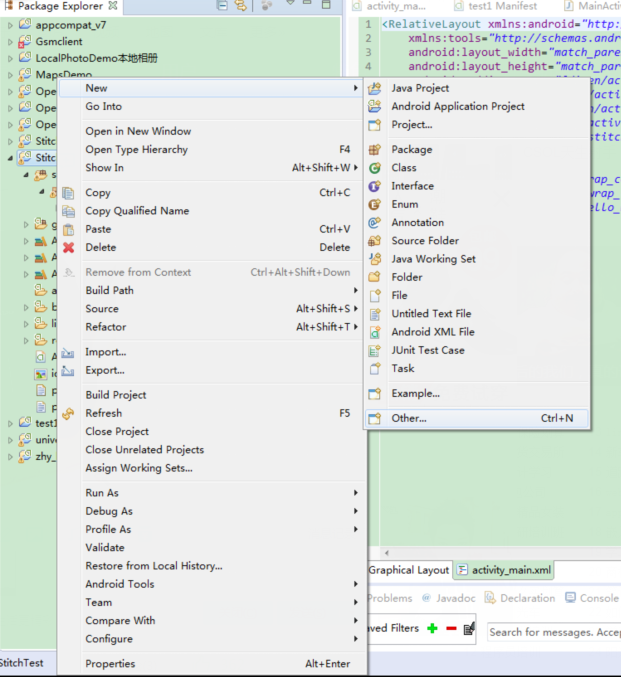

# 说明

这是一个安卓手机上简单的全景图片拼接Demo。我利用了opencv4android提供的java的api和c++拼接函数。
运行Demo之前请先安装 OpenCV Manager 这个通过opencv4android官网提供的sdk获得，sdk目录下有一个apk文件夹，找到里面对应你测试手机的opencv manager的apk。

------------

## 开发环境

我使用的IDE是Eclipse，安卓版本是5.0，我安装的Opencv manager版本是OpenCV_2.4.8_Manager_2.16_armv7a-neon.apk，对应我手机的内核是arm的。
jdk版本是1.8.0_77。ndk版本是r10b，opencv4android的sdk版本是2.4.8。在部署环境之前，我们假设你电脑里已经有了opencv4android的sdk和ndk，并且都安装到了非中文目录中。

## 部署

在eclipse中部署Opencv4andoid的开发环境有些复杂，如果想利用ndk来做opencv4android的开发，我建议首先把ndk的helloworld的demo跑通，我之后会写一篇利用ndk来跑helloworld的demo。
这里直接介绍opencv4android的ndk开发的环境部署。

第一步：新建安卓程序，对应安卓版本是默认的我没有修改。


第二步：右键项目名StitchTest-new-other-Convert to a C/C++ Project(Adds C/C++ Native)-next，选择你的项目StitchTest，点击finish。这一步是为了给该项目添加c/c++属性，使项目支持c/c++编程。
 


第三步：右键项目名StitchTest-properties，点击Android-Add，弹出Project Selection对话框，选择之前下到的opencv4android2.4.8版本的sdk，点击ok添加进了项目需要的库函数中，如图。


第四步：点击properties中的Builders-New...弹出对话框Choose configuration type，选择Program，在弹出的对话框中Main选项卡设置ndkbuild和当前的工作目录，在Refresh选项卡里设置如图，在Build Options选项卡设置如图


第五步：点击properties中的c/c++build-encironment 设置c/c++环境中的ndk目录，在c/c++ General设置Paths and symbols 如图


在保存完builder之后，可能会发现builder一直在build，那么你可以将eclipse里的project选项下的build automatically去掉即可。
至此环境部署完毕！

## 代码详解

``` java
import java.io.File;
import java.text.SimpleDateFormat;
import java.util.Date;
import org.opencv.android.BaseLoaderCallback;
import org.opencv.android.LoaderCallbackInterface;
import org.opencv.android.OpenCVLoader;
import org.opencv.core.CvType;
import org.opencv.core.Mat;
import org.opencv.highgui.Highgui;
import android.app.Activity;
import android.os.Bundle;
import android.os.Environment;
import android.view.View;
import android.widget.Button;
```
首先导入这些包，我在demo中要对图片进行读写操作，所以要导入java下的io包，我把保存的图片名字以当前时间命名，所以导入时间格式的包，导入的opencv几个包是用来在java端对图片进行保存操作以及调用opencv端javaapi的。

``` java
	private BaseLoaderCallback mLoaderCallback = new BaseLoaderCallback(this) {
		@Override
		public void onManagerConnected(int status) {
			switch (status) {
			case LoaderCallbackInterface.SUCCESS: {
				System.loadLibrary("native_sample");
			}
				break;
			default: {
				super.onManagerConnected(status);
			}
				break;
			}
		}
	};
```
这是在opencv4android利用ndk开发的时候，用这个来进入c++的函数中的，编译器通过build整个工程，将工程下面的jni部分，生成一个.so类库，这个.so类库的名字就是上面代码中System.loadLibrary("native_sample");里native_sample。执行的时候，直接调用这个.so类库，而不是去执行c++代码。如果你把整个环境build之后，生成了.so类库，那么此时你把jni文件夹删掉都是可以的。

``` java
	public void stitchImages() {
		int height = 0;
		int width = 0;
		panorama = new Mat(height, width, CvType.CV_8UC3);
		ImageProc.FindFeatures(panorama.getNativeObjAddr());
		writePano(panorama);
	}
```
生命周期函数不说了，里面就是写了个点击事件，我把拼接函数（耗时操作）放到了主线程里，这是很不好的，但是作为一个初级教程，就先这样放着吧- -
这一步就是拼接函数了,首先对mat类的对象操作的时候，mat有三个参数，高，宽，cvtype。高和宽都要赋初值，否则会报错空指针异常，FindFeatures就是原生接口（native interface），也就是我在c++里写的拼接函数，在java里我把他单独放在了一个类中，这是正规的、官方的写法，mat类的getNativeObjAddr()这个方法得到c++返回的变量作为FindFeature的参数，writePano这个函数是将处理完成的图片保存进手机内存里，并以当前时间命名。Highgui这个函数好像是在后续opencv的版本中换地方了（好像是弃用），使用高版本sdk时候这里会报错。
``` java
	public void stitchImages() {
		int height = 0;
		int width = 0;
		panorama = new Mat(height, width, CvType.CV_8UC3);
		ImageProc.FindFeatures(panorama.getNativeObjAddr());
		writePano(panorama);
	}

	private void writePano(Mat image){
		Date dateNow = new  Date();
		SimpleDateFormat dateFormat = new SimpleDateFormat("yyyyMMdd_HHmmss");
		if(!StitchImageDir.exists())
			StitchImageDir.mkdir();
		Highgui.imwrite(StitchImageDir.getPath()+ File.separator + "panoStich"+dateFormat.format(dateNow) +mImageExt, image);
	}
```
最后在java端使用Opencv4android提供的api，需要复写onResume函数，加上opencv版本的sdk版本号，如果你不用opencv4android提供的java的api，onResume就不用复写。
``` java
	@Override
	public void onResume() {
		super.onResume();
		OpenCVLoader.initAsync(OpenCVLoader.OPENCV_VERSION_2_4_8, this,
				mLoaderCallback);
	}
```
下面是c++端的代码解释
``` c++
extern "C"
{
	JNIEXPORT void JNICALL Java_com_example_stitchimage_ImageProc_FindFeatures(JNIEnv*, jobject,jlong image)
	{
		vector<Mat> imgs;
		bool try_use_gpu = false;
		Mat& pano = *((Mat*) image);

		Mat img = imread("/storage/emulated/0/panoTmpImage/snow1.jpg");
			imgs.push_back(img);
			img = imread("/storage/emulated/0/panoTmpImage/snow2.jpg");
			imgs.push_back(img);

		Stitcher stitcher = Stitcher::createDefault(try_use_gpu);
		Stitcher::Status status = stitcher.stitch(imgs, pano);
	}
}
```
这是c++图像拼接算法，这个imread函数可以用到安卓程序中，读的是手机内存的路径，stitch这个函数是opencv提供的。注意最开始的这一行JNICALL Java_com_example_stitchimage_ImageProc_FindFeatures(JNIEnv*, jobject,jlong image)一定要和你的java端的包名，类名，方法名，完全对应，还有参数要对应，env和obj是必须要存在的两个参数，jlong对应着java的long型变量。
我一直不是很理解，为什么imread函数可以直接读取安卓手机的路径，跟opencv4android群友讨论，得到的答案我也不是很满意。
群友给出的答案是：opencv可以在linux中运行，imread也可以读取绝对路径和相对路径的，就能读安卓设备上的图片了。
接下来看一下工程下面jni文件夹下的Android.mk文件：
include D:\OpenCV-2.4.8-android-sdk\sdk\native\jni\OpenCV.mk这一行指定你本机中opencv的sdk中opencv.mk文件的路径
LOCAL_MODULE    := native_sample这一行指定你通过build生成的.so文件的名字
LOCAL_SRC_FILES := jni_part.cpp这一行指定你的jni文件夹下.cpp文件的名字

这个例程的ui我只放了一个button，点击即拼接指定路径的两张图，重点是实现拼接这个功能。如果你哪里有问题，欢迎在github上提问，我会保持更新。


